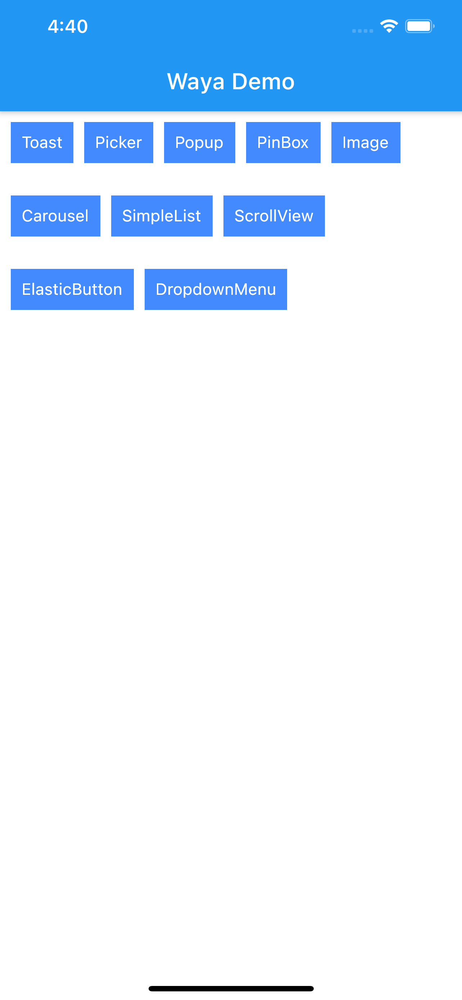
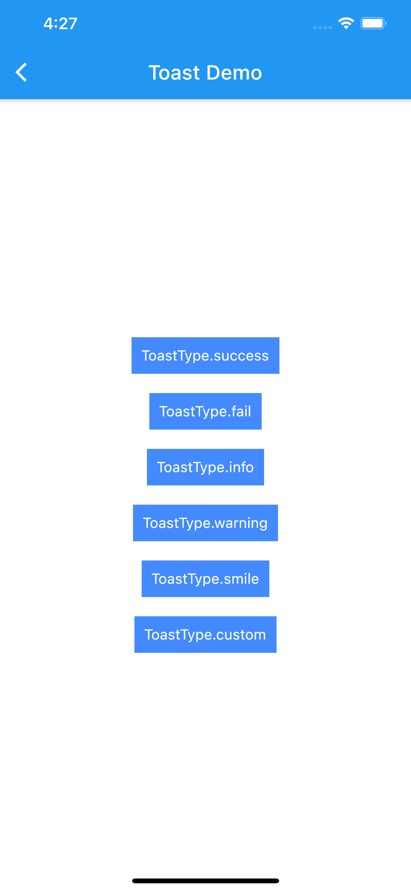
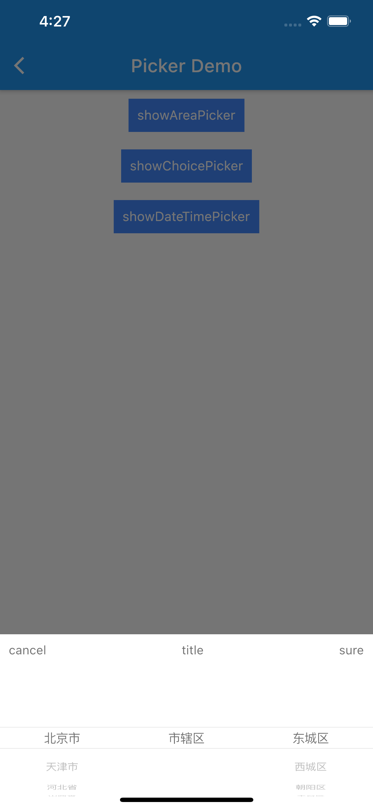
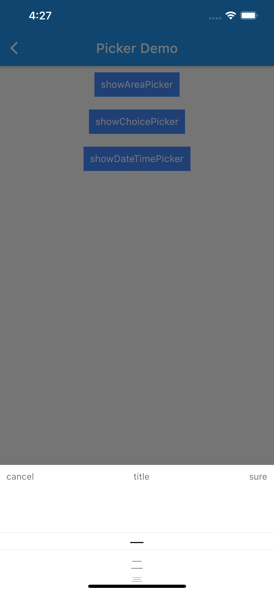
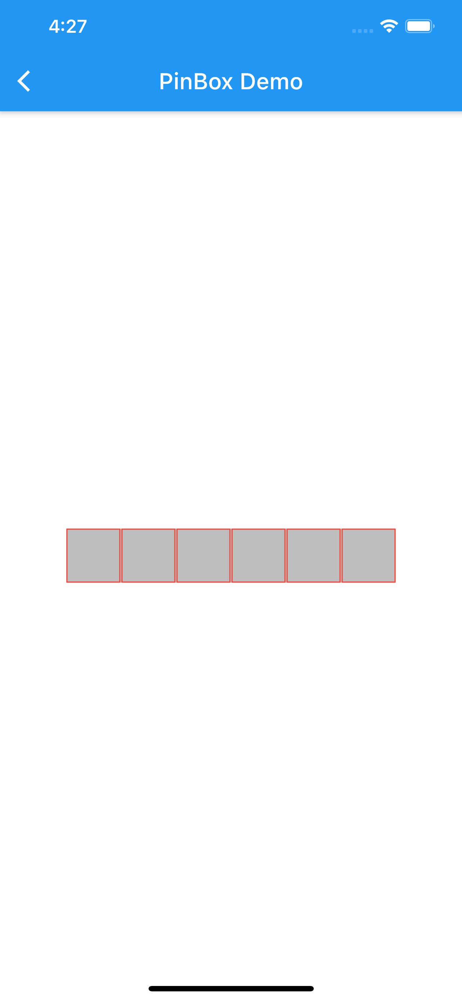
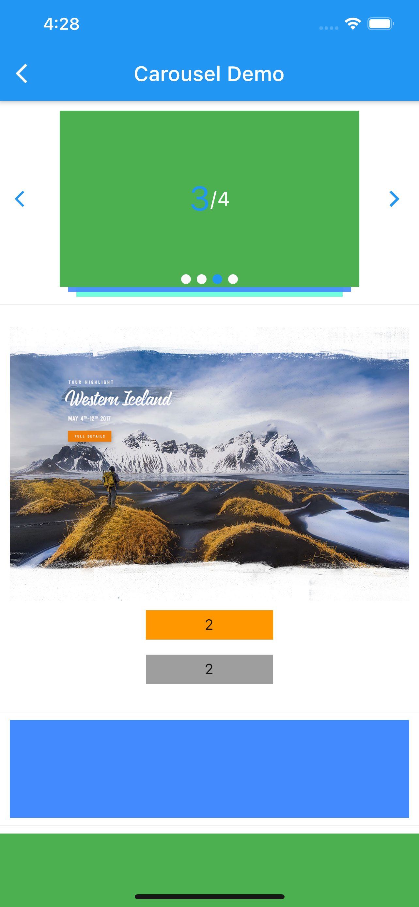
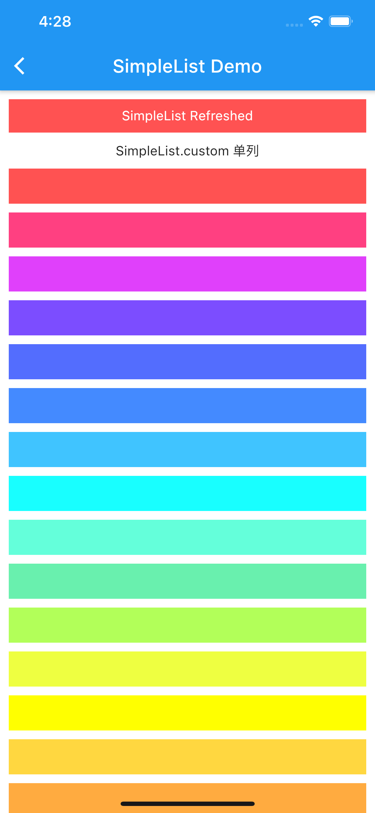
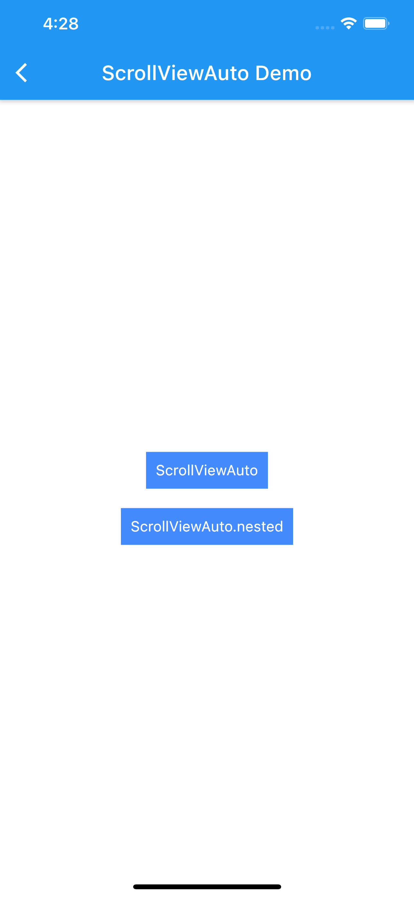
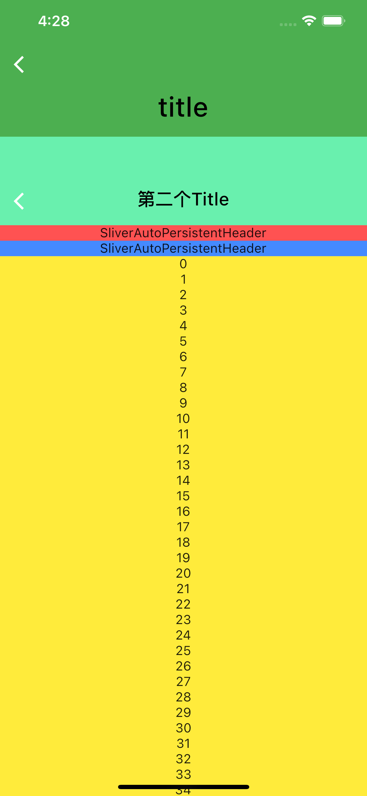
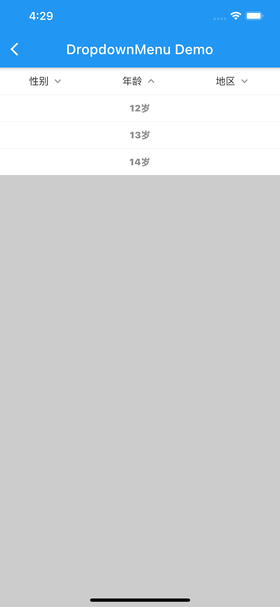

# flutter_waya

## [Example](example)

### 全局弹窗 全局无Context路由跳转 根组件使用 
[GlobalMaterial OverlayScaffold Toast Loading showPopup 路由无context跳转](lib/src/widgets/root.dart) 

### [多个工具类](lib/src/tools)

### [Picker选择器](lib/src/widgets/root/dialog/picker)

### [PopupWidgets 弹窗底层组件](lib/src/widgets/root/dialog/popup_widgets.dart)

### [widgets多个组件](lib/src/widgets/widgets.dart)

## 快捷打包命令 [builds](builds)

### sh android.sh  //即可打包命令 可拷贝builds至自己的项目目录 并修改

 
 
 
 
 
 
